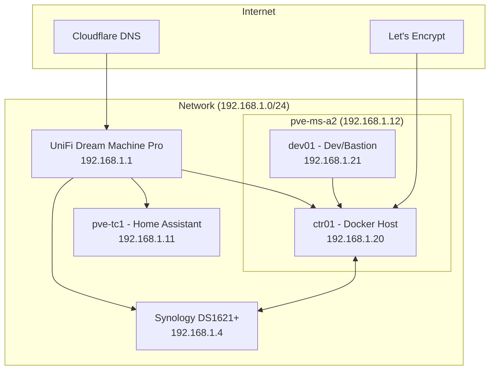
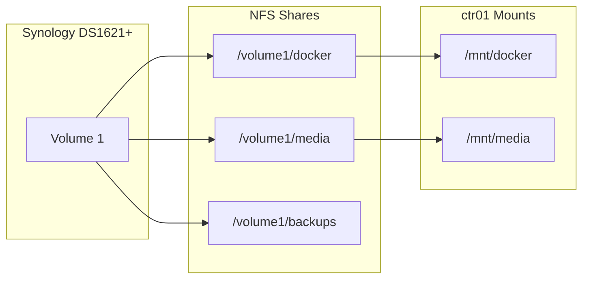

# Architecture Overview

The Stetter Homelab is designed around principles of reproducibility, automation, and maintainability. This section provides a high-level overview of the system architecture.

## Design Principles

1. **Infrastructure as Code** - All infrastructure is defined in code and version controlled
2. **Containerization** - Services run in Docker containers for consistency and portability
3. **Centralized Logging** - All logs flow to Loki for unified observability
4. **Automated Deployments** - GitLab CI/CD pipelines handle deployments
5. **Secure by Default** - Internal services behind Traefik with Let's Encrypt SSL

## System Architecture Diagram

## Virtualization Layer

The primary hypervisor is **Proxmox VE** running on the Minisforum MS-A2. This hosts:

- **ctr01** - Primary Docker host (Debian 13)
- **dev01** - Development and bastion VM (Ubuntu 24.04)

The ThinkCentre (pve-tc1) runs a separate Proxmox instance dedicated to Home Assistant.

## Container Orchestration

Docker Compose is used for all container workloads. Stacks are organized by function:

- **Core Services** - Traefik reverse proxy, Vault secrets management
- **Monitoring** - Prometheus, Grafana, Loki, Jaeger
- **Media** - Plex, Sonarr, Radarr, and the *arr stack
- **AI/ML** - Ollama, Open-WebUI, Whisper
- **Development** - GitLab, code-server, IT-Tools

See [Stacks Overview](../stacks/index.md) for complete details.

## Storage Architecture

### Storage Tiers

| Tier | Location | Purpose |
|------|----------|---------|
| **NAS** | Synology Volume 1 | Docker volumes, media, backups |
| **Local** | VM local storage | OS, temporary files, swap |

## Network Architecture

See [Network Topology](network.md) for detailed network documentation.

### Key Network Segments

- **192.168.1.0/24** - Primary LAN
- **Traefik** - Reverse proxy for all HTTP/HTTPS traffic
- **Cloudflare** - External DNS and DDoS protection
- **Technitium** - Internal DNS resolution

## Security Model

### External Access

1. All external traffic routes through Cloudflare
2. Traefik handles SSL termination with Let's Encrypt wildcards
3. Sensitive services require authentication (Authentik or basic auth)

### Internal Security

1. Internal services communicate over Docker networks
2. Secrets managed via HashiCorp Vault
3. SSH access via bastion host (dev01)
4. SSH-signed commits required for all code changes

## Monitoring and Observability

The monitoring stack provides comprehensive visibility:

| Component | Purpose |
|-----------|---------|
| **Prometheus** | Metrics collection and alerting |
| **Grafana** | Dashboards and visualization |
| **Loki** | Log aggregation |
| **Jaeger** | Distributed tracing |
| **Node Exporter** | Host metrics |

See [Service Catalog](../services/index.md) for access URLs.

## Disaster Recovery

### Backup Strategy

- **Daily**: Database dumps, Docker volume snapshots
- **Weekly**: Full system backups to Synology HDD pool
- **Monthly**: Offsite backup verification

### Recovery Procedures

See [Troubleshooting Runbook](../runbooks/troubleshooting.md) for recovery procedures.
