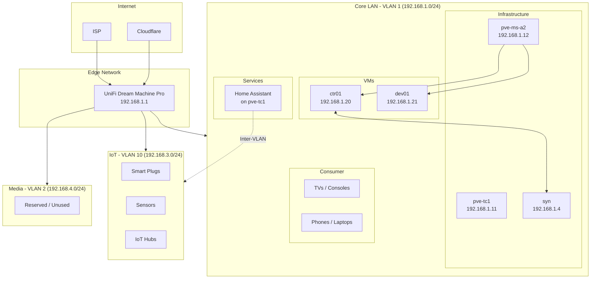
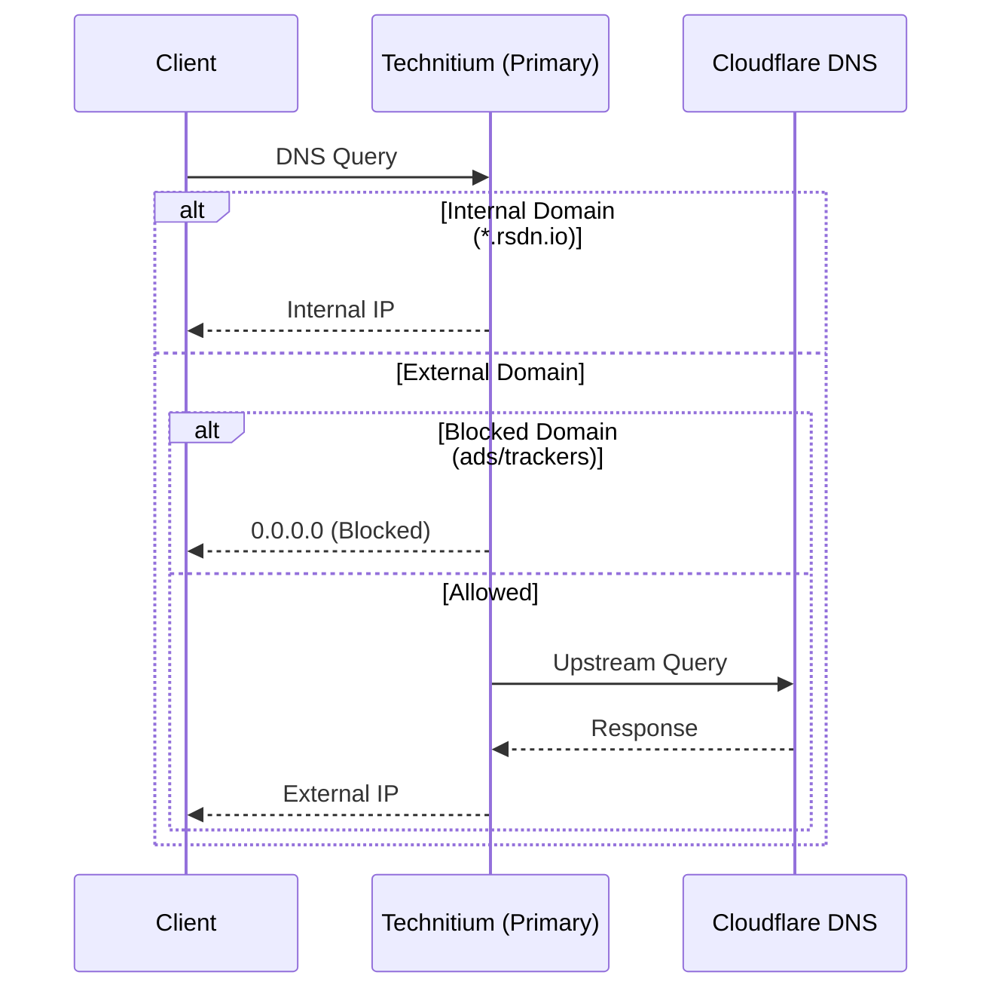
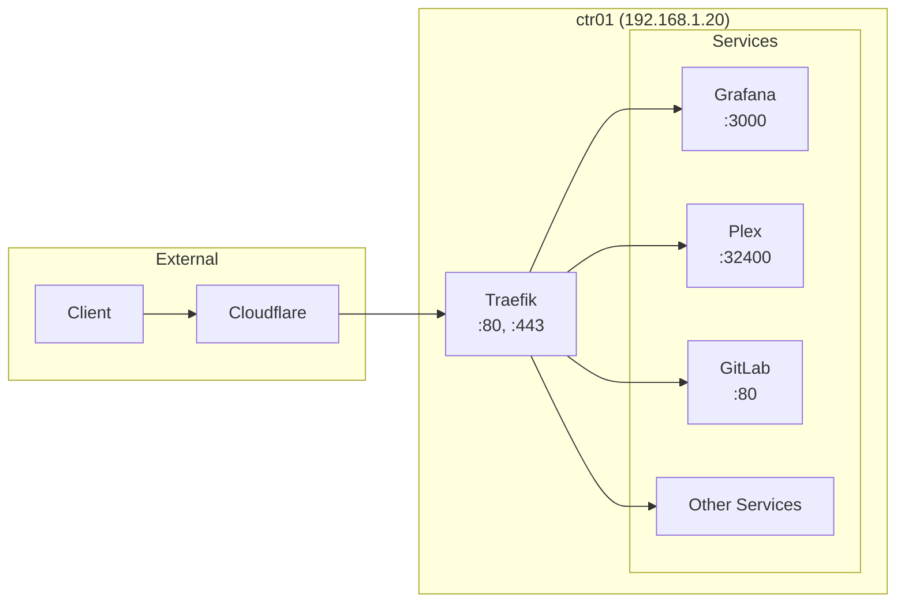

# Network Topology

This document describes the network architecture for the Stetter Homelab.

## VLAN Topology

The network is segmented into multiple VLANs for traffic isolation and security.

| VLAN ID | Subnet | Name | Purpose |
|---------|--------|------|---------|
| 1 | 192.168.1.0/24 | Core LAN | Infrastructure, servers, workstations, consumer devices |
| 10 | 192.168.3.0/24 | IoT | Smart home devices, plugs, sensors |
| 2 | 192.168.4.0/24 | Media | Reserved (currently unused) |

!!! note "VLAN ID to Subnet Mapping"
    VLAN IDs do not align with subnet third octets (e.g., VLAN 10 uses 192.168.3.x, not 192.168.10.x). This is a legacy configuration.

### Core LAN (VLAN 1)

Primary network for trusted devices:

- **Infrastructure**: Proxmox hosts, Synology NAS, MSA2 storage
- **VMs**: Docker hosts, development machines
- **Workstations**: Laptops, desktops
- **Consumer devices**: TVs, gaming consoles (Xbox, PlayStation), phones

### IoT VLAN (VLAN 10)

Isolated network for smart home devices:

- Smart plugs and switches
- Sensors and environmental monitors
- IoT hubs and bridges

!!! info "Home Assistant Access"
    Home Assistant (on Core LAN) requires inter-VLAN routing to discover and control IoT devices. Firewall rules allow HA to initiate connections to the IoT VLAN.

### Media VLAN (VLAN 2)

Currently unused. Originally intended for media devices but consolidated into Core LAN.

## Network Diagram



## IP Address Allocation

### Core LAN (VLAN 1) - 192.168.1.0/24

#### Infrastructure Hosts

| Hostname | IP Address | Role | Notes |
|----------|------------|------|-------|
| rtr | 192.168.1.1 | Router/Firewall | UniFi Dream Machine Pro |
| syn | 192.168.1.4 | NAS | Synology DS1621+, 10GbE |
| pve-tc1 | 192.168.1.11 | Hypervisor | ThinkCentre, Home Assistant |
| pve-ms-a2 | 192.168.1.12 | Hypervisor | Primary Proxmox host |
| ctr01 | 192.168.1.20 | Docker Host | Debian 13 VM |
| dev01 | 192.168.1.21 | Dev/Bastion | Ubuntu 24.04 VM |

#### DHCP Range

- **Gateway:** 192.168.1.1
- **Static Reservations:** 192.168.1.1 - 192.168.1.99
- **DHCP Range:** 192.168.1.100 - 192.168.1.254

### IoT VLAN (VLAN 10) - 192.168.3.0/24

#### DHCP Range

- **Gateway:** 192.168.3.1
- **DHCP Range:** 192.168.3.100 - 192.168.3.254

All IoT devices receive addresses via DHCP. No static reservations configured.

### Media VLAN (VLAN 2) - 192.168.4.0/24

- **Gateway:** 192.168.4.1
- **Status:** Currently unused

## DNS Architecture

### DNS Resolution Flow



### DNS Servers

| Service | Host | IP Address | Purpose |
|---------|------|------------|---------|
| Technitium (Primary) | syn | 192.168.1.4:53 | Primary DNS + ad blocking |
| Technitium (Secondary) | ctr01 | 192.168.1.20:53 | Secondary DNS, failover |

### Internal DNS Zones

All internal services are accessible via `*.rsdn.io`:

| Subdomain | Target | Service |
|-----------|--------|---------|
| traefik.rsdn.io | ctr01 | Traefik Dashboard |
| grafana.rsdn.io | ctr01 | Grafana |
| prometheus.rsdn.io | ctr01 | Prometheus |
| plex.rsdn.io | ctr01 | Plex Media Server |
| gitlab.rsdn.io | ctr01 | GitLab CE |
| portainer.rsdn.io | ctr01 | Portainer |
| ha.rsdn.io | pve-tc1 | Home Assistant |

## Reverse Proxy Architecture

Traefik serves as the central reverse proxy for all HTTP/HTTPS traffic.

### Traffic Flow



### SSL/TLS Configuration

- **Certificate Authority:** Let's Encrypt
- **Challenge Type:** DNS-01 via Cloudflare
- **Certificate Scope:** Wildcard (`*.rsdn.io`)
- **Renewal:** Automatic via Traefik

## Firewall Rules

### Inbound Rules (from Internet)

| Port | Protocol | Destination | Purpose |
|------|----------|-------------|---------|
| 443 | TCP | ctr01 | HTTPS (via Cloudflare) |
| 80 | TCP | ctr01 | HTTP redirect to HTTPS |
| 32400 | TCP | ctr01 | Plex direct access |

### Internal Rules

- All traffic within a VLAN is allowed
- Docker networks are isolated by default
- Cross-stack communication via defined Docker networks

### Inter-VLAN Rules

| Source | Destination | Ports | Purpose |
|--------|-------------|-------|---------|
| Core LAN (VLAN 1) | IoT (VLAN 10) | All | Home Assistant device control |
| IoT (VLAN 10) | Core LAN (VLAN 1) | Blocked | IoT devices cannot initiate to Core |
| IoT (VLAN 10) | Internet | 80, 443, NTP | Limited outbound for updates |

!!! warning "IoT Isolation"
    IoT devices are restricted from initiating connections to the Core LAN. This prevents compromised IoT devices from attacking infrastructure.

## VPN Configuration

### WireGuard (Future)

VPN access is planned for remote administration:

- **Server:** UniFi Dream Machine Pro
- **Subnet:** 10.0.0.0/24
- **Access:** Full LAN access for authenticated clients

## Network Hardware

### UniFi Dream Machine Pro

- **Role:** Router, Firewall, VPN Server
- **Features:**
    - IDS/IPS enabled
    - DPI for traffic analysis
    - Automatic threat management

### 10GbE Connectivity

The Synology DS1621+ has 10GbE connectivity for high-throughput storage access:

- **Connection:** Direct link to pve-ms-a2
- **Use Case:** NFS mounts for Docker volumes, media streaming

## Troubleshooting

### Common Network Issues

!!! warning "DNS Resolution Failures"
    If DNS resolution fails:

    1. Check Technitium status on syn
    2. Verify secondary DNS on ctr01
    3. Test upstream connectivity: `dig @1.1.1.1 example.com`

!!! tip "Traefik Routing Issues"
    If services are unreachable:

    1. Check Traefik dashboard at `traefik.rsdn.io`
    2. Verify service labels in docker-compose
    3. Check for certificate issues in Traefik logs

### Useful Commands

```bash
# Test internal DNS resolution
dig @192.168.1.4 grafana.rsdn.io

# Check Traefik routing
curl -I https://grafana.rsdn.io

# Test connectivity between hosts
ping -c 3 192.168.1.4

# Check open ports
nmap -p 80,443,32400 192.168.1.20
```
