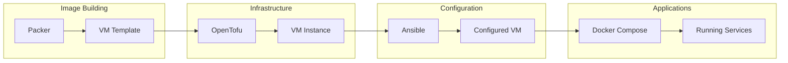

# Infrastructure Overview

The Stetter Homelab infrastructure is managed as code using a combination of Packer, OpenTofu (Terraform), and Ansible. This approach ensures reproducibility and makes it easy to rebuild the environment when needed.

## Infrastructure as Code Philosophy

> "Make it easy to rebuild when things inevitably break"

All infrastructure configuration lives in version-controlled GitLab repositories. Nothing is configured manually that can be automated.

## Repository Structure

| Repository | Purpose | Tools |
|------------|---------|-------|
| [vm-platform](https://gitlab.com/stetter-homelab/vm-platform) | VM provisioning and configuration | Packer, OpenTofu, Ansible |
| [k8s-platform](https://gitlab.com/stetter-homelab/k8s-platform) | Kubernetes cluster management | OpenTofu, Helm |
| [ctr01-stacks](https://gitlab.com/stetter-homelab/ctr01-stacks) | Docker Compose stacks for ctr01 | Docker Compose |
| [syn-stacks](https://gitlab.com/stetter-homelab/syn-stacks) | Docker Compose stacks for Synology | Docker Compose |

## Provisioning Workflow



## Tool Stack

### Packer

Creates reproducible VM templates for Proxmox:

- **Base Images:** Debian 13, Ubuntu 24.04
- **Preinstalled:** Docker, monitoring agents, SSH keys
- **Output:** Proxmox VM templates

```bash
# Build a new template
cd vm-platform
devbox run packer build debian-13.pkr.hcl
```

### OpenTofu

Provisions VMs from templates:

- **Provider:** Proxmox (via bpg/proxmox)
- **State:** Local or GitLab-managed
- **Resources:** VMs, cloud-init, networking

```bash
# Plan and apply infrastructure
cd vm-platform
devbox run tofu plan
devbox run tofu apply
```

### Ansible

Configures VMs after provisioning:

- **Inventory:** Dynamic from OpenTofu state
- **Roles:** Docker, monitoring, security hardening
- **Playbooks:** Site-wide configuration

```bash
# Run configuration
cd vm-platform
devbox run ansible-playbook site.yml
```

### Docker Compose

Manages containerized applications:

- **Location:** ctr01 and syn
- **Organization:** Stacks by function
- **Deployment:** GitLab CI/CD or manual

```bash
# Deploy a stack
cd ctr01-stacks/monitoring
docker-compose up -d
```

## Development Environment

All IaC tools are managed via [Devbox](https://www.jetify.com/devbox) for reproducible development environments:

```bash
# Enter project environment
cd ~/projects/vm-platform
devbox shell

# Tools are now available
packer version
tofu version
ansible --version
```

See `devbox.json` in each repository for the specific tool versions.

## GitLab CI/CD Integration

Each repository has GitLab CI/CD configured for:

1. **Validation** - Syntax checking, linting
2. **Planning** - Show what will change
3. **Deployment** - Apply changes (manual trigger)

Example pipeline stages:

```yaml
stages:
  - validate
  - plan
  - apply

validate:
  script:
    - tofu validate
    - ansible-lint

plan:
  script:
    - tofu plan -out=plan.tfplan
  artifacts:
    paths:
      - plan.tfplan

apply:
  script:
    - tofu apply plan.tfplan
  when: manual
  only:
    - main
```

## State Management

### OpenTofu State

- **Location:** Local filesystem or GitLab-managed backend
- **Backup:** Committed to repository (encrypted sensitive values)
- **Locking:** GitLab-managed backend provides locking

### Docker Volume Data

- **Location:** Synology NFS mounts
- **Backup:** Daily snapshots via Synology Hyper Backup
- **Restore:** Mount backup and copy data

## Secrets Management

### HashiCorp Vault

Vault runs on ctr01 and manages:

- Docker registry credentials
- API keys for external services
- Database passwords
- SSL certificates (backup)

### Environment Files

Sensitive configuration in `.env` files:

- Never committed to git
- `.env.example` templates provided
- Stored in Vault for backup

## Next Steps

- [VM Platform Details](vm-platform.md)
- [Kubernetes Platform Details](k8s-platform.md)
- [Adding New Stacks](../runbooks/new-stack.md)
