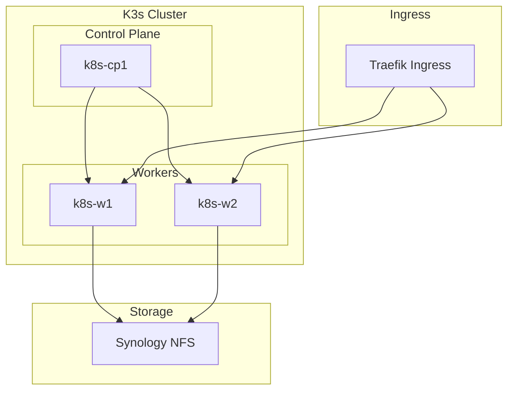

# Kubernetes Platform

The k8s-platform repository manages Kubernetes cluster configuration for the Stetter Homelab.

**Repository:** [stetter-homelab/k8s-platform](https://gitlab.com/stetter-homelab/k8s-platform)

## Overview

!!! note "Future Development"
    The Kubernetes platform is currently in development. Most workloads run on Docker Compose on ctr01. K8s is planned for stateless workloads that benefit from orchestration.

This repository will contain:

- **OpenTofu configurations** for K3s cluster provisioning
- **Helm charts** for application deployment
- **ArgoCD configurations** for GitOps

## Planned Architecture



## Repository Structure (Planned)

```
k8s-platform/
├── tofu/
│   ├── main.tf                # Cluster provisioning
│   ├── variables.tf
│   └── modules/
│       └── k3s-node/          # K3s node module
├── helm/
│   ├── charts/                # Custom Helm charts
│   └── values/                # Environment-specific values
├── argocd/
│   ├── applications/          # ArgoCD Application manifests
│   └── projects/              # ArgoCD Project definitions
├── manifests/
│   └── base/                  # Base Kubernetes manifests
├── devbox.json
└── .gitlab-ci.yml
```

## Cluster Specifications (Planned)

| Node | Role | vCPUs | RAM | Disk |
|------|------|-------|-----|------|
| k8s-cp1 | Control Plane | 2 | 4GB | 50GB |
| k8s-w1 | Worker | 4 | 8GB | 100GB |
| k8s-w2 | Worker | 4 | 8GB | 100GB |

## Technology Stack

### K3s

Lightweight Kubernetes distribution chosen for:

- Low resource overhead
- Built-in Traefik ingress
- Simple installation
- SQLite backend (single control plane)

### Helm

Package manager for Kubernetes applications:

- Standard charts from artifact hub
- Custom charts for homelab apps
- Values files per environment

### ArgoCD

GitOps continuous delivery:

- Automatic sync from Git
- Application health monitoring
- Rollback capabilities

## Planned Workloads

These workloads are candidates for migration to Kubernetes:

| Workload | Reason | Priority |
|----------|--------|----------|
| n8n | Stateless automation | Medium |
| IT-Tools | Simple web app | Low |
| Code-server | Dev environment | Low |

!!! info "Docker Compose Preferred"
    Most workloads will remain on Docker Compose for simplicity. Kubernetes is reserved for workloads that benefit from:

    - Horizontal scaling
    - Complex scheduling
    - Self-healing
    - Rolling updates

## Getting Started

When the platform is ready:

```bash
# Clone the repository
git clone https://gitlab.com/stetter-homelab/k8s-platform.git
cd k8s-platform

# Enter development environment
devbox shell

# Provision cluster
cd tofu
tofu init
tofu apply

# Deploy applications
kubectl apply -f argocd/
```

## Integration Points

### Storage

Synology NFS provides persistent storage:

```yaml
# StorageClass for Synology NFS
apiVersion: storage.k8s.io/v1
kind: StorageClass
metadata:
  name: nfs-synology
provisioner: nfs.csi.k8s.io
parameters:
  server: 192.168.1.4
  share: /volume1/k8s
```

### Monitoring

Prometheus and Grafana on ctr01 will scrape K8s metrics:

- Node metrics via Node Exporter
- Cluster metrics via kube-state-metrics
- Application metrics via ServiceMonitor

### Ingress

Traefik on ctr01 will route to K8s services:

- External traffic through existing Traefik
- K8s Traefik ingress for internal routing
- Shared wildcard certificate

## Current Status

| Component | Status | Notes |
|-----------|--------|-------|
| Repository | Created | Basic structure |
| Tofu Config | Not Started | Awaiting time |
| Helm Charts | Not Started | |
| ArgoCD | Not Started | |
| Documentation | In Progress | This page |

## Next Steps

1. [ ] Define resource requirements
2. [ ] Create K3s provisioning with Tofu
3. [ ] Set up ArgoCD for GitOps
4. [ ] Migrate first workload
5. [ ] Document operations

## Related Documentation

- [VM Platform](vm-platform.md) - Underlying VM provisioning
- [ctr01 Stacks](../stacks/ctr01.md) - Current Docker workloads
- [Architecture Overview](../architecture/index.md) - System design
