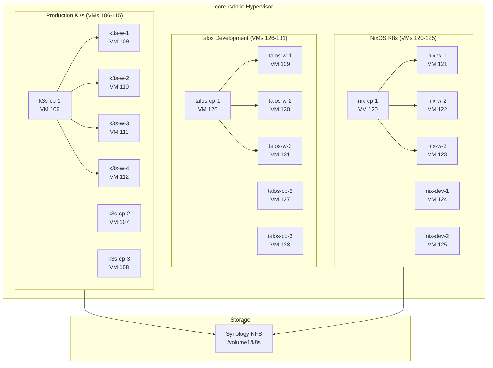

# Kubernetes Platform

The Stetter Homelab runs **multiple active Kubernetes clusters** on core.rsdn.io for development, testing, and production workloads. This represents a hybrid infrastructure approach where Docker Compose handles stateful services on MS-A2, while Kubernetes manages stateless and experimental workloads.

## Active Clusters

!!! info "Production K8s Clusters"
    Multiple Kubernetes clusters are actively running on core.rsdn.io with different approaches:
    
    - **Production K8s**: Traditional K3s cluster (7 VMs)
    - **Talos Development**: Talos Linux clusters (6 VMs) 
    - **NixOS/Terraform**: Infrastructure-as-code approach (6 VMs)

## Infrastructure Overview

### Production K8s Cluster (VMs 106-115)

**Status**: 🟢 **Active Production**

| Node | VM ID | Role | vCPUs | RAM | Disk |
|------|-------|------|-------|-----|------|
| k3s-cp-1 | 106 | Control Plane | 4 | 16GB | 50GB |
| k3s-cp-2 | 107 | Control Plane | 4 | 16GB | 50GB |
| k3s-cp-3 | 108 | Control Plane | 4 | 16GB | 50GB |
| k3s-w-1 | 109 | Worker | 4 | 16GB | 100GB |
| k3s-w-2 | 110 | Worker | 4 | 16GB | 100GB |
| k3s-w-3 | 111 | Worker | 4 | 16GB | 100GB |
| k3s-w-4 | 112 | Worker | 4 | 16GB | 100GB |

**Total Resources**: 7 VMs, 28 vCPUs, 112GB RAM

### Talos Development Cluster (VMs 126-131)

**Status**: 🔄 **Active Development**

**Related Repositories**:
- [talos-platform](https://gitlab.com/stetter-homelab/talos-platform): CLI-based Talos setup
- [talos-terraform-poc](https://gitlab.com/stetter-homelab/talos-terraform-poc): Terraform provider approach

| Node | VM ID | Role | vCPUs | RAM | Disk |
|------|-------|------|-------|-----|------|
| talos-cp-1 | 126 | Control Plane | 2 | 4GB | 50GB |
| talos-cp-2 | 127 | Control Plane | 2 | 4GB | 50GB |
| talos-cp-3 | 128 | Control Plane | 2 | 4GB | 50GB |
| talos-w-1 | 129 | Worker | 2 | 4GB | 50GB |
| talos-w-2 | 130 | Worker | 2 | 4GB | 50GB |
| talos-w-3 | 131 | Worker | 2 | 4GB | 50GB |

**Total Resources**: 6 VMs, 12 vCPUs, 24GB RAM

### NixOS/Terraform K8s Cluster (VMs 120-125)

**Status**: 🔄 **Active Development**

**Repository**: [k8s-platform](https://gitlab.com/stetter-homelab/k8s-platform)

| Node | VM ID | Role | OS | Purpose |
|------|-------|------|-----|---------|
| k8s-nix-cp-1 | 120 | Control Plane | NixOS | K8s master |
| k8s-nix-w-1 | 121 | Worker | NixOS | K8s worker |
| k8s-nix-w-2 | 122 | Worker | NixOS | K8s worker |
| k8s-nix-w-3 | 123 | Worker | NixOS | K8s worker |
| nix-dev-1 | 124 | Development | Ubuntu | Terraform/dev |
| nix-dev-2 | 125 | Development | Ubuntu | Terraform/dev |

**Total Resources**: 6 VMs, Mixed specs for development

## Talos Linux Projects

Talos Linux is a modern, secure, and immutable Kubernetes OS. Two parallel approaches are being developed:

### talos-platform (CLI Approach)

**Repository**: [talos-platform](https://gitlab.com/stetter-homelab/talos-platform)

**Philosophy**: CLI-driven cluster management using talosctl and kubectl

**Features**:
- **Immutable OS**: No SSH, no package manager, only Kubernetes API
- **Secure by Default**: All services run as containers, minimal attack surface  
- **Machine Configuration**: Declarative node configuration via YAML
- **Control Plane HA**: etcd clustering across 3 control plane nodes
- **Certificate Management**: Automatic certificate rotation and renewal

**Cluster Management**:
```bash
# Bootstrap cluster
talosctl bootstrap --nodes 192.168.1.126

# Generate machine configs
talosctl gen config homelab-talos https://192.168.1.126:6443

# Apply configurations
talosctl apply-config --insecure --nodes 192.168.1.126 --file controlplane.yaml
talosctl apply-config --insecure --nodes 192.168.1.129 --file worker.yaml

# Get kubeconfig
talosctl kubeconfig --nodes 192.168.1.126
```

### talos-terraform-poc (Infrastructure as Code)

**Repository**: [talos-terraform-poc](https://gitlab.com/stetter-homelab/talos-terraform-poc)

**Philosophy**: Terraform provider-driven automation for full lifecycle management

**Features**:
- **Terraform Provider**: Uses `siderolabs/talos` provider for declarative management
- **GitOps Integration**: Machine configurations stored in Git, applied via CI/CD
- **Secrets Management**: Terraform state manages cluster certificates and tokens
- **VM Provisioning**: Proxmox VMs provisioned and configured in single workflow
- **Validation**: Automated cluster health checks and workload deployment tests

**Example Terraform Configuration**:
```hcl
resource "talos_machine_configuration_apply" "controlplane" {
  client_configuration        = talos_machine_secrets.cluster.client_configuration
  machine_configuration_input = data.talos_machine_configuration.controlplane.machine_configuration
  count                       = 3
  node                        = "192.168.1.${126 + count.index}"
}

resource "talos_machine_bootstrap" "bootstrap" {
  depends_on = [talos_machine_configuration_apply.controlplane]
  node       = "192.168.1.126"
}
```

### Talos Comparison Matrix

| Aspect | CLI Approach | Terraform Approach |
|--------|-------------|-------------------|
| **Learning Curve** | Steeper (new CLI tools) | Gentler (familiar Terraform) |
| **Automation** | Manual scripts | Full GitOps integration |
| **State Management** | External (Git) | Terraform state |
| **Cluster Updates** | Manual talosctl | Automated via CI/CD |
| **Development Speed** | Faster iteration | Slower, more thorough |
| **Production Readiness** | Manual oversight | Automated validation |

## Active Architecture


```mermaid
graph TB
    subgraph core["core.rsdn.io Hypervisor"]
        subgraph prod["Production K3s (VMs 106-115)"]
            PCP1[k3s-cp-1<br/>VM 106]
            PCP2[k3s-cp-2<br/>VM 107] 
            PCP3[k3s-cp-3<br/>VM 108]
            PW1[k3s-w-1<br/>VM 109]
            PW2[k3s-w-2<br/>VM 110]
            PW3[k3s-w-3<br/>VM 111]
            PW4[k3s-w-4<br/>VM 112]
        end

        subgraph talos["Talos Development (VMs 126-131)"]
            TCP1[talos-cp-1<br/>VM 126]
            TCP2[talos-cp-2<br/>VM 127]
            TCP3[talos-cp-3<br/>VM 128]
            TW1[talos-w-1<br/>VM 129]
            TW2[talos-w-2<br/>VM 130]
            TW3[talos-w-3<br/>VM 131]
        end

        subgraph nixos["NixOS K8s (VMs 120-125)"]
            NCP1[nix-cp-1<br/>VM 120]
            NW1[nix-w-1<br/>VM 121]
            NW2[nix-w-2<br/>VM 122]
            NW3[nix-w-3<br/>VM 123]
            DEV1[nix-dev-1<br/>VM 124]
            DEV2[nix-dev-2<br/>VM 125]
        end
    end

    subgraph storage["Storage"]
        SYN[Synology NFS<br/>/volume1/k8s]
    end

    %% Production connections
    PCP1 --> PW1
    PCP1 --> PW2
    PCP1 --> PW3
    PCP1 --> PW4
    
    %% Talos connections  
    TCP1 --> TW1
    TCP1 --> TW2
    TCP1 --> TW3

    %% NixOS connections
    NCP1 --> NW1
    NCP1 --> NW2
    NCP1 --> NW3

    %% Storage connections
    prod --> SYN
    talos --> SYN
    nixos --> SYN
```

## Repository Structures

### k8s-platform (NixOS Approach)
```
k8s-platform/
├── tofu/
│   ├── main.tf                # Cluster provisioning
│   ├── variables.tf
│   └── modules/
│       └── k3s-node/          # K3s node module
├── helm/
│   ├── charts/                # Custom Helm charts
│   └── values/                # Environment-specific values
├── argocd/
│   ├── applications/          # ArgoCD Application manifests
│   └── projects/              # ArgoCD Project definitions
├── manifests/
│   └── base/                  # Base Kubernetes manifests
├── devbox.json
└── .gitlab-ci.yml
```

### talos-platform (CLI Approach)
```
talos-platform/
├── configs/
│   ├── controlplane.yaml     # Control plane configuration
│   ├── worker.yaml           # Worker node configuration
│   └── secrets.yaml          # Cluster secrets
├── scripts/
│   ├── bootstrap.sh          # Cluster bootstrap
│   ├── apply-config.sh       # Apply configurations
│   └── upgrade.sh            # Cluster upgrades
├── manifests/
│   └── workloads/            # Application manifests
└── docs/
    └── procedures.md         # Operational procedures
```

### talos-terraform-poc (IaC Approach)
```
talos-terraform-poc/
├── terraform/
│   ├── main.tf               # Main infrastructure
│   ├── talos.tf              # Talos cluster config
│   └── proxmox.tf            # VM provisioning
├── configs/
│   └── generated/            # Generated machine configs
├── tests/
│   └── cluster-validation/   # Automated tests
└── .gitlab-ci.yml            # CI/CD pipeline
```

## Technology Stack

### Kubernetes Distributions

**K3s (Production & NixOS clusters)**:
- Low resource overhead (~500MB RAM per node)
- Built-in Traefik ingress controller
- Simple installation and upgrades
- Embedded etcd for HA clusters

**Talos Linux (Talos clusters)**:
- Immutable, secure Kubernetes OS
- API-driven management (no SSH)
- Automatic security updates
- Minimal attack surface

### Package Management

**Helm**: Standard Kubernetes package manager
- Community charts from Artifact Hub
- Custom charts for homelab applications
- Environment-specific value overrides

**ArgoCD**: GitOps continuous delivery (planned)
- Declarative application definitions
- Automatic sync from Git repositories
- Application health monitoring and rollback

### Infrastructure as Code

**OpenTofu/Terraform**: VM and cluster provisioning
- Proxmox provider for VM lifecycle
- Talos provider for cluster configuration
- Automated infrastructure deployment

## Active Workloads

### Current K8s Workloads

| Workload | Cluster | Status | Purpose |
|----------|---------|--------|---------|
| **Monitoring** | Production K3s | Active | Prometheus, Grafana for K8s clusters |
| **Development Tools** | NixOS K8s | Testing | Code-server, development environments |
| **Talos Validation** | Talos Dev | Active | Cluster functionality testing |
| **ArgoCD** | Production K3s | Planned | GitOps deployment platform |

### Docker vs Kubernetes Strategy

!!! info "Hybrid Approach"
    **Docker Compose** (MS-A2 ctr01): Stateful, single-instance services
    - Databases (PostgreSQL, Redis)
    - Media services (Plex, *arr stack)
    - Core infrastructure (Traefik, Vault)
    
    **Kubernetes** (core.rsdn.io): Stateless, scalable workloads
    - Development environments
    - Monitoring and observability
    - Experimental services
    - CI/CD platforms

## Getting Started

### Accessing Active Clusters

**Production K3s Cluster**:
```bash
# SSH to core.rsdn.io
ssh core.rsdn.io

# Access cluster from any control plane node
kubectl get nodes
kubectl get pods --all-namespaces
```

**Talos Clusters**:
```bash
# Clone talos-platform repository
git clone https://gitlab.com/stetter-homelab/talos-platform.git
cd talos-platform

# Use talosctl to interact with cluster
talosctl --nodes 192.168.1.126 get members
talosctl --nodes 192.168.1.126 dashboard

# Get kubeconfig
talosctl kubeconfig --nodes 192.168.1.126
kubectl get nodes
```

**Terraform Talos**:
```bash
# Clone terraform POC
git clone https://gitlab.com/stetter-homelab/talos-terraform-poc.git
cd talos-terraform-poc

# Enter development environment
devbox shell

# Deploy cluster
cd terraform
terraform init
terraform apply
```

### Development Workflow

1. **Experiment on Talos dev cluster** (VMs 126-131)
2. **Test on NixOS cluster** (VMs 120-125) 
3. **Deploy to Production K3s** (VMs 106-115)
4. **Document learnings** in respective repositories

## Integration Points

### Storage

**Synology NFS** provides persistent storage for K8s workloads:

```yaml
# StorageClass for Synology NFS
apiVersion: storage.k8s.io/v1
kind: StorageClass
metadata:
  name: nfs-synology
provisioner: nfs.csi.k8s.io
parameters:
  server: 192.168.1.4
  share: /volume1/k8s
  mountOptions: "vers=4.1,hard,intr"
```

**Storage Performance**:
- **Bandwidth**: 1GbE (~100MB/s) via management network
- **Latency**: <10ms local network access
- **Use Cases**: Config maps, persistent volumes, backup storage

### Monitoring

**Cross-Platform Observability**:

| Monitoring Stack | Location | Scrapes | Purpose |
|------------------|----------|---------|---------|
| **Primary** | ctr01 (Docker) | All infrastructure | Unified dashboards |
| **K8s Native** | K3s clusters | K8s workloads only | Cluster-specific metrics |

**Metrics Collection**:
- **Node Exporter**: Host-level metrics on all K8s nodes
- **kube-state-metrics**: Kubernetes API object metrics
- **Prometheus Operator**: Application metrics via ServiceMonitor
- **Cross-cluster federation**: Production → ctr01 Prometheus

### Networking

**Hybrid Network Architecture**:

| Network | Purpose | Access |
|---------|---------|--------|
| **192.168.1.0/24** | Management, inter-cluster | All hosts |
| **10.42.0.0/16** | K3s pod network | Cluster internal |
| **10.43.0.0/16** | K3s service network | Cluster internal |

**Service Exposure**:
- **Internal**: ClusterIP services within clusters
- **Cross-cluster**: NodePort services on management network
- **External**: Traefik on ctr01 proxies to K8s NodePort services

### DNS and Service Discovery

**DNS Resolution**:
- **Internal K8s**: CoreDNS within each cluster
- **Cross-cluster**: Manual service registration in Technitium DNS
- **External**: Cloudflare DNS for public services

**Service Registration**:
```bash
# Example: Expose K8s service externally
kubectl expose deployment app --type=NodePort --port=80
# Register app.rsdn.io → 192.168.1.106:30080 in Technitium
```

## Current Status

| Component | Status | Cluster | Notes |
|-----------|--------|---------|-------|
| **Production K3s** | ✅ Active | VMs 106-115 | 7-node HA cluster |
| **Talos Development** | ✅ Active | VMs 126-131 | 6-node dev cluster |
| **NixOS K8s** | 🔄 Development | VMs 120-125 | Infrastructure testing |
| **talos-platform** | ✅ Active | CLI management | Working cluster ops |
| **talos-terraform-poc** | 🔄 Development | IaC automation | Terraform provider testing |
| **k8s-platform** | 🔄 Development | NixOS approach | OpenTofu + Helm |
| **Monitoring** | ✅ Operational | Cross-cluster | Prometheus federation |
| **Storage** | ✅ Operational | Synology NFS | Persistent volumes |
| **ArgoCD** | 📋 Planned | GitOps | Next development phase |

**Legend**: ✅ Production Ready | 🔄 Active Development | 📋 Planned

## Next Steps

### Short Term (Q2 2025)
1. [x] ~~Deploy production K3s cluster~~ **Complete**
2. [x] ~~Establish Talos development environment~~ **Complete**  
3. [x] ~~Implement cluster monitoring~~ **Complete**
4. [ ] Deploy ArgoCD on production K3s
5. [ ] Migrate first stateless workload from Docker

### Medium Term (Q3 2025)
1. [ ] Standardize on Talos approach (CLI vs Terraform)
2. [ ] Implement cross-cluster service mesh
3. [ ] Add cluster backup and disaster recovery
4. [ ] Performance testing and optimization

### Long Term (Q4 2025)
1. [ ] Evaluate cluster federation
2. [ ] Consider hardware refresh for dedicated K8s nodes
3. [ ] Implement zero-downtime deployment pipelines

## Related Documentation

- [VM Platform](vm-platform.md) - Underlying VM provisioning
- [ctr01 Stacks](../stacks/ctr01.md) - Current Docker workloads
- [Architecture Overview](../architecture/index.md) - System design
