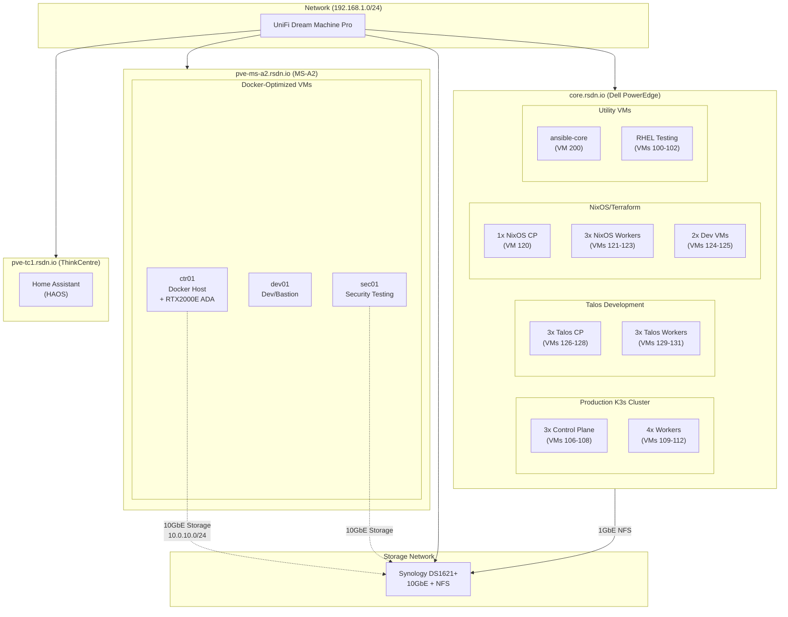

# Virtual Machine Overview

Comprehensive overview of all virtual machines across the hybrid Stetter Homelab infrastructure.

## Hypervisor Overview

| Hypervisor | Role | Active VMs | Total Resources | Specialization |
|------------|------|------------|-----------------|----------------|
| **pve-ms-a2** | Docker Host | 3 VMs | 18 vCPUs, 40GB RAM | Docker + GPU workloads |
| **core.rsdn.io** | K8s Sandbox | ~26 VMs | ~200 vCPUs, 200GB+ RAM | Kubernetes development |
| **pve-tc1** | Dedicated | 1 VM | 2 vCPUs, 4GB RAM | Home Assistant only |

## MS-A2 VM Inventory (Docker-focused)

| VM Name | Purpose | OS | vCPUs | RAM | Disk | Management IP | Storage IP | Status |
|---------|---------|-----|-------|-----|------|---------------|------------|--------|
| **ctr01** | Docker host | Debian 13 | 10 | 24GB | 150GB | 192.168.1.20 | 10.0.10.20 | ✅ Active |
| **dev01** | Development/bastion | Ubuntu 24.04 | 4 | 8GB | 50GB | 192.168.1.21 | - | ✅ Active |
| **sec01** | Security testing | Kali Linux | 4 | 8GB | 80GB | 192.168.1.25 | 10.0.10.25 | ✅ Active |

## core.rsdn.io VM Inventory (K8s-focused)

### Production K8s Cluster (VMs 106-115)
| VM Name | Role | OS | vCPUs | RAM | Disk | IP Address | Status |
|---------|------|-----|-------|-----|------|------------|--------|
| **k3s-cp-1** | Control Plane | Ubuntu 22.04 | 4 | 16GB | 50GB | 192.168.1.106 | ✅ Active |
| **k3s-cp-2** | Control Plane | Ubuntu 22.04 | 4 | 16GB | 50GB | 192.168.1.107 | ✅ Active |
| **k3s-cp-3** | Control Plane | Ubuntu 22.04 | 4 | 16GB | 50GB | 192.168.1.108 | ✅ Active |
| **k3s-w-1** | Worker | Ubuntu 22.04 | 4 | 16GB | 100GB | 192.168.1.109 | ✅ Active |
| **k3s-w-2** | Worker | Ubuntu 22.04 | 4 | 16GB | 100GB | 192.168.1.110 | ✅ Active |
| **k3s-w-3** | Worker | Ubuntu 22.04 | 4 | 16GB | 100GB | 192.168.1.111 | ✅ Active |
| **k3s-w-4** | Worker | Ubuntu 22.04 | 4 | 16GB | 100GB | 192.168.1.112 | ✅ Active |

### Talos Development Cluster (VMs 126-131)
| VM Name | Role | OS | vCPUs | RAM | Disk | IP Address | Status |
|---------|------|-----|-------|-----|------|------------|--------|
| **talos-cp-1** | Control Plane | Talos Linux | 2 | 4GB | 50GB | 192.168.1.126 | ✅ Active |
| **talos-cp-2** | Control Plane | Talos Linux | 2 | 4GB | 50GB | 192.168.1.127 | ✅ Active |
| **talos-cp-3** | Control Plane | Talos Linux | 2 | 4GB | 50GB | 192.168.1.128 | ✅ Active |
| **talos-w-1** | Worker | Talos Linux | 2 | 4GB | 50GB | 192.168.1.129 | ✅ Active |
| **talos-w-2** | Worker | Talos Linux | 2 | 4GB | 50GB | 192.168.1.130 | ✅ Active |
| **talos-w-3** | Worker | Talos Linux | 2 | 4GB | 50GB | 192.168.1.131 | ✅ Active |

### NixOS/Terraform K8s Cluster (VMs 120-125)
| VM Name | Role | OS | vCPUs | RAM | Disk | IP Address | Status |
|---------|------|-----|-------|-----|------|------------|--------|
| **k8s-nix-cp-1** | Control Plane | NixOS | 4 | 8GB | 50GB | 192.168.1.120 | ✅ Active |
| **k8s-nix-w-1** | Worker | NixOS | 4 | 8GB | 100GB | 192.168.1.121 | ✅ Active |
| **k8s-nix-w-2** | Worker | NixOS | 4 | 8GB | 100GB | 192.168.1.122 | ✅ Active |
| **k8s-nix-w-3** | Worker | NixOS | 4 | 8GB | 100GB | 192.168.1.123 | ✅ Active |
| **nix-dev-1** | Development | Ubuntu 22.04 | 2 | 4GB | 50GB | 192.168.1.124 | ✅ Active |
| **nix-dev-2** | Development | Ubuntu 22.04 | 2 | 4GB | 50GB | 192.168.1.125 | ✅ Active |

### Utility VMs (core.rsdn.io)
| VM Name | Purpose | OS | vCPUs | RAM | Disk | IP Address | Status |
|---------|---------|-----|-------|-----|------|------------|--------|
| **ansible-core** | Automation | Ubuntu 22.04 | 2 | 4GB | 50GB | 192.168.1.200 | ✅ Active |
| **rch-01** | RHEL Testing | RHEL 9 | 2 | 4GB | 50GB | 192.168.1.100 | ✅ Active |
| **rch-02** | RHEL Testing | RHEL 9 | 2 | 4GB | 50GB | 192.168.1.101 | ✅ Active |
| **rch-03** | RHEL Testing | RHEL 9 | 2 | 4GB | 50GB | 192.168.1.102 | ✅ Active |

### Templates (9000+ series)
| Template | Base OS | Purpose | Status |
|----------|---------|---------|--------|
| **debian-13-template** | Debian 13 | Docker host template | ✅ Active |
| **ubuntu-22-template** | Ubuntu 22.04 | K8s node template | ✅ Active |
| **kali-2025-template** | Kali Linux 2025.4 | Security testing template | ✅ Active |

## pve-tc1 VM Inventory (Dedicated HA)

| VM Name | Purpose | OS | vCPUs | RAM | Disk | IP Address | Status |
|---------|---------|-----|-------|-----|------|------------|--------|
| **Home Assistant** | Home automation | HAOS | 2 | 4GB | 32GB | 192.168.1.11 | ✅ Active |

## Hybrid Infrastructure Architecture



**Legend**:
- **Solid lines**: Management network (1GbE)
- **Dashed lines**: Storage network (10GbE)
- **MS-A2**: Docker + GPU workloads
- **core.rsdn.io**: Kubernetes development sandbox
- **pve-tc1**: Dedicated Home Assistant

## VM Categories

### Docker Infrastructure (MS-A2)

#### Production Services (ctr01)
**Purpose**: Hosts critical homelab services and applications

- **Container Runtime**: Docker with compose stacks  
- **Services**: Traefik, Prometheus, Grafana, Media Stack, AI services
- **GPU Acceleration**: NVIDIA RTX2000E ADA for Plex transcoding, Frigate, Ollama
- **Storage**: High-speed 10GbE NFS for container volumes
- **Networking**: Dual NIC for management (1GbE) and storage (10GbE)

[View ctr01 Details →](ctr01/README.md)

#### Development Environment (dev01)
**Purpose**: Development environment and infrastructure bastion host

- **Role**: Development workstation and SSH jump host
- **Tools**: Development environments, build tools, Git repositories
- **Access**: Primary SSH gateway for infrastructure management
- **Integration**: Access to both Docker and K8s environments

[View dev01 Details →](dev01/README.md)

#### Security Testing (sec01)
**Purpose**: Dedicated security research and penetration testing

- **Operating System**: Kali Linux 2025.4 with comprehensive toolsets
- **Tools**: Complete penetration testing and vulnerability assessment toolkit
- **GUI Access**: X11 forwarding for graphical security applications
- **Evidence Storage**: High-speed 10GbE NFS for large datasets and captures
- **Network Access**: Isolated testing environments and production network access

[View sec01 Details →](sec01/README.md)

### Kubernetes Infrastructure (core.rsdn.io)

#### Production Kubernetes (K3s)
**Purpose**: Stable Kubernetes cluster for production workloads

- **Architecture**: 3-node HA control plane + 4 worker nodes
- **Distribution**: K3s for low resource overhead
- **Resources**: 112GB RAM total across 7 VMs
- **Use Cases**: Development platforms, monitoring, stateless applications

#### Talos Linux Development
**Purpose**: Immutable, secure Kubernetes OS evaluation

- **Architecture**: 3-node HA control plane + 3 worker nodes
- **Distribution**: Talos Linux for maximum security
- **Management**: Two approaches - CLI (talosctl) and Terraform
- **Use Cases**: Security-focused K8s, GitOps testing, infrastructure research

#### NixOS/Terraform Kubernetes
**Purpose**: Declarative infrastructure and system configuration

- **Architecture**: 1-node control plane + 3 worker nodes + 2 development VMs
- **Distribution**: NixOS for declarative system management  
- **Management**: Infrastructure as Code with Terraform
- **Use Cases**: Infrastructure automation, configuration management research

#### Utility and Testing
**Purpose**: Supporting infrastructure and experimental workloads

- **ansible-core**: Centralized automation and configuration management
- **RHEL Testing**: Enterprise Linux compatibility and certification testing
- **Templates**: Golden images for rapid VM provisioning

### Dedicated Infrastructure (pve-tc1)

#### Home Assistant
**Purpose**: Dedicated home automation platform

- **Architecture**: Single-purpose hypervisor for reliability
- **OS**: Home Assistant Operating System
- **Isolation**: Separate from development infrastructure for stability

## Infrastructure Details

### Hybrid Hypervisor Platform

#### MS-A2 (Docker-Optimized)
- **Host**: pve-ms-a2.rsdn.io (Proxmox 8.x)
- **Management**: Proxmox Web UI at https://pve-ms-a2.rsdn.io:8006
- **Hardware**: Minisforum MS-A2 with AMD Ryzen 9 9955HX, 64GB DDR5
- **Specialization**: Docker workloads, GPU passthrough, 10GbE storage

#### core.rsdn.io (K8s-Optimized) 
- **Host**: core.rsdn.io (Proxmox 8.x)
- **Management**: Proxmox Web UI at https://core.rsdn.io:8006
- **Hardware**: Dell PowerEdge with dual Xeon X5675, 256GB DDR3
- **Specialization**: Kubernetes development sandbox, extensive VM capacity

#### pve-tc1 (Dedicated HA)
- **Host**: pve-tc1.rsdn.io (Proxmox 8.x)  
- **Management**: Proxmox Web UI at https://pve-tc1.rsdn.io:8006
- **Hardware**: Lenovo ThinkCentre with Intel Core i5, 16GB DDR4
- **Specialization**: Home Assistant dedicated host

### Network Configuration

#### Management Network (192.168.1.0/24)
- **Purpose**: VM management, SSH access, web interfaces
- **Gateway**: 192.168.1.1 (UniFi Dream Machine)
- **DNS**: 192.168.1.4 (Pi-hole)
- **DHCP Range**: 192.168.1.100-199 (static assignments for VMs)

#### Storage Network (10.0.10.0/24)
- **Purpose**: High-speed storage traffic (NFS, backups)
- **Bandwidth**: 10 Gigabit direct connection
- **NFS Server**: Synology DS1823xs+ (10.0.10.10)
- **Performance**: Optimized for large file transfers and evidence storage

### Storage Architecture

#### VM Local Storage
- **Type**: Local SSD storage on Proxmox
- **Usage**: OS, applications, temporary files
- **Performance**: High IOPS for system responsiveness

#### NFS Shared Storage
- **Server**: Synology DS1823xs+ NAS
- **Access**: 10G network for high throughput
- **Usage**: Persistent data, media files, backups, evidence storage
- **Redundancy**: RAID 6 configuration with hot spare

## VM Management

### Provisioning
VMs are provisioned using infrastructure-as-code:

- **Templates**: Built with Packer (golden images)
- **Provisioning**: OpenTofu for VM creation and configuration
- **Configuration**: Ansible for post-deployment setup

### Monitoring and Maintenance
- **Monitoring**: Prometheus + Grafana for metrics
- **Log Aggregation**: Loki + Promtail for centralized logging
- **Backups**: Scheduled VM snapshots and data backups
- **Updates**: Automated security updates where appropriate

### Access Control
- **Authentication**: SSH key-based access only
- **Network Access**: VPN or local network required
- **Privilege Escalation**: sudo access for administrative tasks
- **Audit Logging**: All administrative actions logged

## Performance Characteristics

### Resource Allocation Strategy

| VM | CPU Strategy | Memory Strategy | Storage Strategy |
|----|--------------|-----------------|------------------|
| ctr01 | High allocation (production services) | High allocation (container overhead) | Local + NFS hybrid |
| dev01 | Moderate allocation (development tasks) | Moderate allocation (IDE/tools) | Primarily local |
| sec01 | Moderate allocation (security tools) | High allocation (analysis tools) | Local + NFS evidence |

### Network Performance

| Traffic Type | Expected Throughput | Optimization |
|--------------|-------------------|--------------|
| Management SSH | 1-10 Mbps | Low latency priority |
| X11 Forwarding | 10-100 Mbps | Compression enabled |
| NFS Storage | 1-10 Gbps | Dedicated 10G network |
| Container Registry | 100 Mbps - 1 Gbps | Cached locally |

## Security Considerations

### Network Security
- **Firewall**: iptables rules on each VM
- **Network Segmentation**: VLANs for different traffic types
- **VPN Access**: Required for external access to management interfaces
- **SSH Hardening**: Key-only authentication, custom ports

### Data Security
- **Encryption**: Full disk encryption for sensitive VMs
- **Evidence Handling**: Secure chain of custody for sec01
- **Backup Encryption**: Encrypted backups for all persistent data
- **Access Logging**: Comprehensive audit trails

### Compliance Considerations
- **Evidence Retention**: Defined policies for security assessment data
- **Data Classification**: Clear classification of homelab vs. assessment data
- **Secure Disposal**: Proper wiping of decommissioned storage

## Capacity Planning

### Current Utilization by Hypervisor

#### MS-A2 Docker Host Utilization
| Resource | ctr01 | dev01 | sec01 | Total Used | Host Capacity | Available |
|----------|-------|-------|-------|------------|---------------|-----------|
| vCPUs | 10 | 4 | 4 | 18 cores | 32 cores | 14 cores |
<<<<<<< HEAD
| RAM | 24GB | 16GB | 12GB | 52GB | 128GB | 76GB |
| Storage | 100GB | 50GB | 120GB | 270GB | 2TB | 1730GB |
=======
| RAM | 24GB | 8GB | 8GB | 40GB | 64GB | 24GB |
| Storage | 150GB | 50GB | 80GB | 280GB | 2TB+ | 1.7TB+ |

#### core.rsdn.io K8s Sandbox Utilization  
| Resource | Production K3s | Talos Dev | NixOS K8s | Utility VMs | Total Used | Host Capacity | Available |
|----------|---------------|-----------|------------|-------------|------------|---------------|-----------|
| vCPUs | 28 cores | 12 cores | 20 cores | 8 cores | 68 cores | 100+ cores | 32+ cores |
| RAM | 112GB | 24GB | 32GB | 16GB | 184GB | 256GB | 72GB |
| Storage | 650GB | 300GB | 450GB | 200GB | 1.6TB | 10TB+ | 8.4TB+ |

#### pve-tc1 Dedicated HA Utilization
| Resource | Home Assistant | Total Used | Host Capacity | Available |
|----------|----------------|------------|---------------|-----------|
| vCPUs | 2 cores | 2 cores | 8 cores | 6 cores |
| RAM | 4GB | 4GB | 16GB | 12GB |
| Storage | 32GB | 32GB | 256GB | 224GB |
>>>>>>> bd2fd95 (docs(vms): add VM documentation and update inventory)

### Growth Planning
- **MS-A2**: Capacity for 1-2 additional Docker VMs
- **core.rsdn.io**: Extensive capacity for K8s experimentation (256GB RAM)
- **Seasonal Scaling**: Ability to temporarily increase allocations across hosts
- **Disaster Recovery**: Cross-host failover capabilities for critical services

## Disaster Recovery

### Backup Strategy
- **VM Snapshots**: Nightly snapshots retained for 7 days
- **Data Backups**: Critical data backed up to offsite storage
- **Configuration Backup**: Infrastructure code in Git repositories

### Recovery Procedures
- **VM Recovery**: Restore from snapshots or rebuild from templates
- **Data Recovery**: Restore from NFS snapshots or offsite backups
- **Infrastructure Recovery**: Redeploy using stored IaC configurations

### Testing
- **Regular Testing**: Monthly recovery drills for critical systems
- **Documentation**: Detailed recovery procedures documented and tested
- **Communication**: Clear escalation and communication procedures

## Development Roadmap

### Completed Infrastructure (2025-Q1)
✅ **Hybrid Architecture**: MS-A2 + core.rsdn.io specialization complete  
✅ **Multiple K8s Clusters**: Production K3s, Talos dev, NixOS testing active  
✅ **Security Testing**: Kali Linux sec01 with comprehensive toolkit  
✅ **10GbE Storage**: High-speed NFS for container workloads  
✅ **GPU Acceleration**: RTX2000E ADA for Plex, Frigate, Ollama  

### Current Development (Q2 2025)
🔄 **Talos Platform**: Evaluating CLI vs Terraform approaches  
🔄 **ArgoCD Deployment**: GitOps for K8s workload management  
🔄 **Cross-Cluster Monitoring**: Federated Prometheus across environments  
🔄 **VM Cleanup**: Retiring legacy VMs on core.rsdn.io  

### Planned Improvements (Q3-Q4 2025)
📋 **Standardize K8s Approach**: Choose between K3s, Talos, NixOS methodologies  
📋 **Service Mesh**: Implement cross-cluster service mesh  
📋 **Backup Strategy**: K8s-native backup and disaster recovery  
📋 **Performance Optimization**: Resource allocation tuning  

### Infrastructure Considerations
- **Storage Expansion**: Monitor NFS utilization growth with video/security data
- **Network Monitoring**: Evaluate 10GbE utilization and potential 25G upgrade  
- **Resource Rebalancing**: Optimize VM allocation between Docker and K8s hosts
- **Hardware Refresh**: Plan for future hardware upgrade cycles

## VM Documentation

### Detailed VM Guides

| VM | Purpose | Documentation |
|----|---------|--------------|
| **dev01** | Development/Bastion | [dev01 VM Guide →](dev01/README.md) |
| **ctr01** | Docker Host | [ctr01 VM Guide →](ctr01/README.md) |
| **sec01** | Security Testing | [sec01 VM Guide →](sec01/README.md) |

Each VM guide includes:
- Complete specifications and architecture
- Network configuration details
- Quick start guides and common workflows
- Pre-installed tools and setup procedures
- Performance optimization recommendations
- Security considerations and best practices
- Troubleshooting and support information

## VM Documentation

### Detailed VM Guides

| VM | Purpose | Documentation |
|----|---------|--------------|
| **dev01** | Development/Bastion | [dev01 VM Guide →](dev01/README.md) |
| **ctr01** | Docker Host | [ctr01 VM Guide →](ctr01/README.md) |
| **sec01** | Security Testing | [sec01 VM Guide →](sec01/README.md) |

Each VM guide includes:
- Complete specifications and architecture
- Network configuration details
- Quick start guides and common workflows
- Pre-installed tools and setup procedures
- Performance optimization recommendations
- Security considerations and best practices
- Troubleshooting and support information

## Related Documentation

- [VM Platform Overview](../vm-platform.md) - Infrastructure-as-code implementation
- [VM Lifecycle Management](../../runbooks/vm-lifecycle.md) - Operational procedures
- [Hardware Inventory](../../architecture/hardware.md) - Physical infrastructure
- [Network Topology](../../architecture/network.md) - Network configuration
- [Backup and Recovery](../../runbooks/backup-restore.md) - DR procedures

## Quick Reference

### SSH Access

#### MS-A2 VMs (Docker Infrastructure)
```bash
# Docker and development VMs
ssh stetter@192.168.1.20  # ctr01 (Docker host)
ssh stetter@192.168.1.21  # dev01 (Development)
ssh stetter@192.168.1.25  # sec01 (Security testing)

# With X11 forwarding (for sec01 GUI tools)
ssh -X stetter@192.168.1.25
```

#### core.rsdn.io VMs (K8s Infrastructure)
```bash
# Production K3s cluster
ssh stetter@192.168.1.106  # k3s-cp-1
ssh stetter@192.168.1.109  # k3s-w-1

# Talos development cluster  
ssh stetter@192.168.1.126  # talos-cp-1 (Talos has no SSH - use talosctl)
talosctl --nodes 192.168.1.126 get members

# NixOS/Terraform K8s
ssh stetter@192.168.1.120  # k8s-nix-cp-1
ssh stetter@192.168.1.124  # nix-dev-1

# Utility VMs
ssh stetter@192.168.1.200  # ansible-core
ssh stetter@192.168.1.100  # rch-01 (RHEL testing)
```

### Kubernetes Access
```bash
# Production K3s cluster
ssh stetter@192.168.1.106
kubectl get nodes

# Talos cluster (API-only access)
talosctl --nodes 192.168.1.126 kubeconfig
kubectl --kubeconfig talosconfig get nodes

# NixOS K8s cluster
ssh stetter@192.168.1.120
kubectl get nodes
```

### Management URLs
- **MS-A2 Proxmox**: https://pve-ms-a2.rsdn.io:8006
- **core.rsdn.io Proxmox**: https://core.rsdn.io:8006  
- **pve-tc1 Proxmox**: https://pve-tc1.rsdn.io:8006
- **Synology NAS**: https://syn.rsdn.io:5001 / https://192.168.1.4:5001
- **VM Monitoring**: https://grafana.rsdn.io/d/vm-overview

### Common Operations

#### Proxmox Management
```bash
# Check VM status
ssh pve-ms-a2 'qm list'      # MS-A2 VMs
ssh core.rsdn.io 'qm list'   # K8s VMs
ssh pve-tc1 'qm list'        # HA VM

# VM power operations (replace XXX with VM ID)
ssh pve-ms-a2 'qm start XXX'   # Start VM
ssh pve-ms-a2 'qm stop XXX'    # Graceful stop  
ssh pve-ms-a2 'qm reset XXX'   # Hard reset
```

#### Kubernetes Operations
```bash
# K3s cluster management
kubectl get nodes --all-namespaces
kubectl get pods --all-namespaces

# Talos cluster management
talosctl --nodes 192.168.1.126 health
talosctl --nodes 192.168.1.126 dashboard
```

#### Docker Stack Management  
```bash
# Access ctr01 Docker host
ssh ctr01
cd /opt/stacks/<stack-name>
docker-compose ps
docker-compose logs -f <service>
```