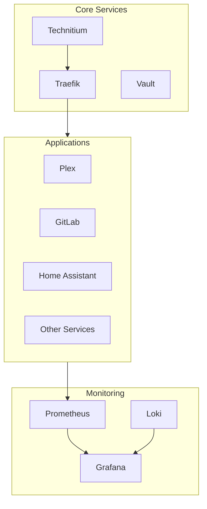

# Service Catalog

Complete catalog of all services running in the Stetter Homelab with access URLs and status.

## Quick Access

### Core Infrastructure

| Service | URL | Host | Purpose |
|---------|-----|------|---------|
| Traefik | [traefik.rsdn.io](https://traefik.rsdn.io) | ctr01 | Reverse proxy dashboard |
| Vault | [vault.rsdn.io](https://vault.rsdn.io) | ctr01 | Secrets management |
| Technitium (Primary) | [dns.rsdn.io](https://dns.rsdn.io) | syn | Primary DNS + ad blocking |
| Technitium (Secondary) | [dns-ctr01.rsdn.io](https://dns-ctr01.rsdn.io) | ctr01 | Secondary DNS |

### Monitoring & Observability

| Service | URL | Host | Purpose |
|---------|-----|------|---------|
| Grafana | [grafana.rsdn.io](https://grafana.rsdn.io) | ctr01 | Dashboards |
| Prometheus | [prometheus.rsdn.io](https://prometheus.rsdn.io) | ctr01 | Metrics |
| Jaeger | [jaeger.rsdn.io](https://jaeger.rsdn.io) | ctr01 | Tracing |
| Loki | Internal only | ctr01 | Logs |

### Management

| Service | URL | Host | Purpose |
|---------|-----|------|---------|
| Portainer | [portainer.rsdn.io](https://portainer.rsdn.io) | ctr01 | Container management |
| Dozzle | [dozzle.rsdn.io](https://dozzle.rsdn.io) | ctr01 | Log viewer |
| Semaphore | [semaphore.rsdn.io](https://semaphore.rsdn.io) | ctr01 | Ansible UI |

### Media

| Service | URL | Host | Purpose |
|---------|-----|------|---------|
| Plex | [plex.rsdn.io](https://plex.rsdn.io) | ctr01 | Media streaming |
| Jellyfin | [jellyfin.rsdn.io](https://jellyfin.rsdn.io) | ctr01 | Media streaming |
| Emby | [emby.rsdn.io](https://emby.rsdn.io) | ctr01 | Media streaming |
| Tautulli | [tautulli.rsdn.io](https://tautulli.rsdn.io) | ctr01 | Plex statistics |
| Sonarr | [sonarr.rsdn.io](https://sonarr.rsdn.io) | ctr01 | TV automation |
| Radarr | [radarr.rsdn.io](https://radarr.rsdn.io) | ctr01 | Movie automation |
| Lidarr | [lidarr.rsdn.io](https://lidarr.rsdn.io) | ctr01 | Music automation |
| Bazarr | [bazarr.rsdn.io](https://bazarr.rsdn.io) | ctr01 | Subtitles |
| SABnzbd | [sabnzbd.rsdn.io](https://sabnzbd.rsdn.io) | ctr01 | Usenet |

### AI & Automation

| Service | URL | Host | Purpose |
|---------|-----|------|---------|
| Open-WebUI | [chat.rsdn.io](https://chat.rsdn.io) | ctr01 | LLM interface |
| Ollama | Internal only (11434) | ctr01 | LLM server |
| n8n | [n8n.rsdn.io](https://n8n.rsdn.io) | ctr01 | Workflow automation |
| Whisper | Internal only (9000) | ctr01 | Speech-to-text |

### Security & Surveillance

| Service | URL | Host | Purpose |
|---------|-----|------|---------|
| Frigate | [frigate.rsdn.io](https://frigate.rsdn.io) | ctr01 | NVR |
| MQTT | Internal only (1883) | ctr01 | Event bus |

### Development

| Service | URL | Host | Purpose |
|---------|-----|------|---------|
| GitLab | [gitlab.rsdn.io](https://gitlab.rsdn.io) | ctr01 | Source control |
| code-server | [code.rsdn.io](https://code.rsdn.io) | ctr01 | VS Code |
| IT-Tools | [tools.rsdn.io](https://tools.rsdn.io) | ctr01 | Developer utilities |
| [Flame](flame.md) | [flame.rsdn.io](https://flame.rsdn.io) | ctr01 | Infrastructure dashboard & start page |

### Home Automation

| Service | URL | Host | Purpose |
|---------|-----|------|---------|
| Home Assistant | [ha.rsdn.io](https://ha.rsdn.io) | pve-tc1 | Home automation |

---

## Service Details

### Authentication

Most services are protected by one of:

- **Basic Auth** - Simple username/password via Traefik middleware
- **Service Auth** - Built-in authentication (GitLab, Portainer, etc.)
- **Authentik** (Planned) - SSO for all services

### SSL/TLS

All services use HTTPS with Let's Encrypt certificates:

- **Issuer:** Let's Encrypt
- **Type:** Wildcard (`*.rsdn.io`)
- **Renewal:** Automatic via Traefik

### Internal vs External Access

| Access Type | Services | Notes |
|-------------|----------|-------|
| **External** | Plex, GitLab, Home Assistant | Accessible from internet |
| **Internal Only** | Most others | LAN access only |
| **VPN Required** | Sonarr, Radarr, etc. | Behind VPN for privacy |

---

## Service Health

### Monitoring

All services are monitored via:

- **Prometheus** - Metrics collection
- **Grafana** - Dashboards and alerts
- **Uptime Kuma** (Planned) - Status page

### Health Checks

Traefik performs health checks on backend services:

```yaml
labels:
  - "traefik.http.services.myservice.loadbalancer.healthcheck.path=/health"
  - "traefik.http.services.myservice.loadbalancer.healthcheck.interval=30s"
```

---

## Service Dependencies



### Startup Order

1. **DNS** - Must be available for name resolution
2. **Traefik** - Routes all HTTP traffic
3. **Monitoring** - For observability
4. **Applications** - Everything else

---

## Accessing Services

### From Local Network

All services are accessible directly via their `*.rsdn.io` URLs when connected to the local network.

### From External Network

External access options:

1. **VPN** (Recommended) - Connect via WireGuard for full access
2. **Cloudflare Tunnel** (Planned) - Zero-trust access for specific services
3. **Port Forwarding** - Limited services exposed (Plex)

### Mobile Access

Recommended apps:

| Service | iOS App | Android App |
|---------|---------|-------------|
| Plex | Plex | Plex |
| Home Assistant | Home Assistant | Home Assistant |
| Grafana | Grafana | Grafana |

---

## Adding New Services

See [Adding New Stacks](../runbooks/new-stack.md) for the complete process.

Quick checklist:

- [ ] Create docker-compose.yml
- [ ] Add Traefik labels for routing
- [ ] Add DNS record in Technitium
- [ ] Configure monitoring
- [ ] Update this catalog
- [ ] Document in appropriate stack page

---

## Service Lifecycle

### Updating Services

```bash
# Pull latest images
docker compose pull

# Recreate containers
docker compose up -d
```

### Backing Up Services

- Configuration: Version-controlled in Git
- Data: Synology Hyper Backup
- Databases: Daily dumps

### Decommissioning Services

1. Stop the service: `docker compose down`
2. Backup any important data
3. Remove DNS records
4. Remove Traefik configuration
5. Update documentation

---

## Related Documentation

- [ctr01 Stacks](../stacks/ctr01.md)
- [Synology Stacks](../stacks/synology.md)
- [Network Topology](../architecture/network.md)
- [Adding New Stacks](../runbooks/new-stack.md)
