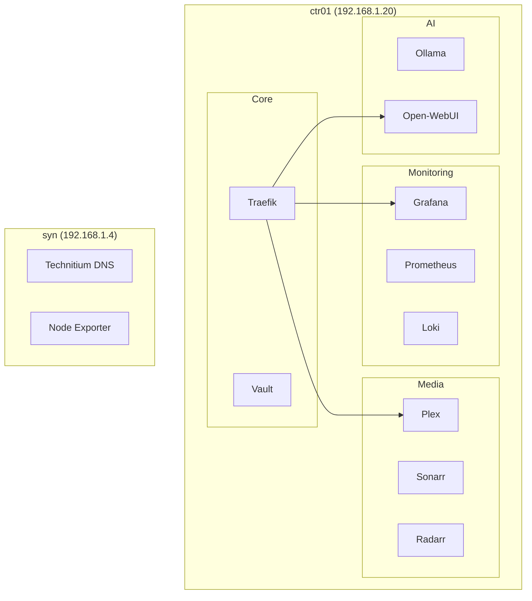
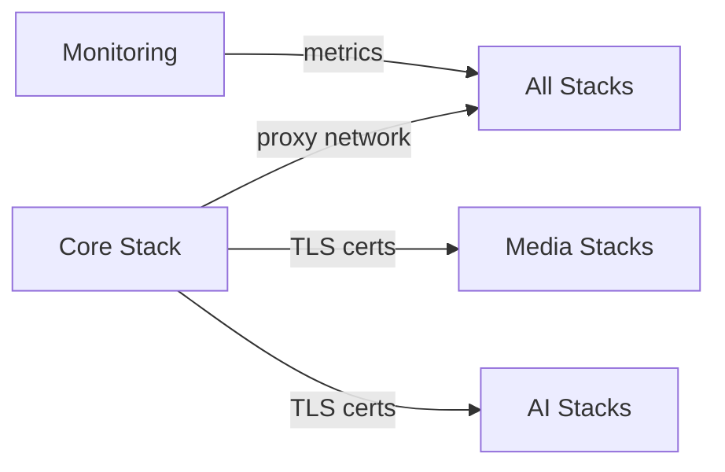

# Stacks Overview

Docker Compose stacks are the primary method for running containerized applications in the Stetter Homelab. Stacks are organized by function and deployed to either ctr01 or the Synology NAS.

## Stack Architecture



## Stack Locations

### ctr01 Stacks

Primary Docker host for most workloads.

**Repository:** [stetter-homelab/compose-stacks](https://gitlab.com/stetter-homelab/compose-stacks) (one repo per stack)

| Stack | Services | Purpose |
|-------|----------|---------|
| [core](ctr01.md#core) | Traefik, Vault | Reverse proxy, secrets |
| [monitoring](ctr01.md#monitoring) | Prometheus, Grafana, Loki, Jaeger | Observability |
| [management](ctr01.md#management) | Portainer, Dozzle, Semaphore | Container management |
| [automation](ctr01.md#automation) | Watchtower | Auto-updates |
| [media-servers](ctr01.md#media-servers) | Plex, Jellyfin, Emby, Tautulli | Media streaming |
| [media](ctr01.md#media) | Sonarr, Radarr, Lidarr, Bazarr, SABnzbd | Media automation |
| [ai](ctr01.md#ai) | Ollama, Open-WebUI, n8n, Whisper | AI/ML workloads |
| [frigate](ctr01.md#frigate) | Frigate, MQTT | NVR, object detection |
| [dev-tools](ctr01.md#dev-tools) | code-server, Flame, IT-Tools | Development |
| [gitlab](ctr01.md#gitlab) | GitLab CE | Source control, CI/CD |
| [technitium](ctr01.md#technitium-ctr01) | Technitium DNS | Secondary DNS (backup) |
| [mcp](ctr01.md#mcp) | MCP Servers | AI agent tools |

### Synology Stacks

Core infrastructure services on the Synology NAS. These run separately from ctr01 to ensure critical services (especially DNS) remain stable during ctr01 maintenance.

**Repository:** [stetter-homelab/syn-stacks](https://gitlab.com/stetter-homelab/syn-stacks)

| Stack | Services | Purpose |
|-------|----------|---------|
| [technitium](synology.md#technitium) | Technitium DNS | **Primary DNS** + ad blocking |
| [node-exporter](synology.md#node-exporter) | Node Exporter | Synology metrics |

## Stack Management

### Directory Structure

Each stack follows a consistent structure:

```
stack-name/
├── docker-compose.yml     # Main compose file
├── .env.example           # Environment template
├── .env                   # Actual secrets (gitignored)
└── config/                # Service configurations
    └── service-name/
```

### Deployment

Stacks are deployed via Docker Compose:

```bash
# Navigate to stack
cd /opt/stacks/monitoring

# Deploy/update
docker compose up -d

# View logs
docker compose logs -f

# Stop stack
docker compose down
```

### Networking

All stacks share common Docker networks:

| Network | Purpose | Stacks |
|---------|---------|--------|
| `proxy` | Traefik routing | All web-accessible services |
| `monitoring` | Metrics collection | Prometheus, exporters |
| `internal` | Inter-service communication | Varies by stack |

### Secrets Management

Secrets are managed via environment files:

1. Copy `.env.example` to `.env`
2. Fill in sensitive values
3. Never commit `.env` files

For additional security, HashiCorp Vault stores backup copies of all secrets.

## Stack Dependencies



### Startup Order

1. **core** - Traefik must start first for routing
2. **monitoring** - For observability from the start
3. **Other stacks** - Can start in any order

## Updating Stacks

### Renovate (Recommended)

[Renovate](renovate.md) automatically monitors Docker image versions and creates merge requests when updates are available.

**How it works:**

1. Renovate scans `docker-compose.yml` files in all stack repositories
2. Creates MRs when new image versions are detected
3. CI validates the changes
4. You review and merge when ready

**Repositories monitored:**

- [compose-stacks](https://gitlab.com/stetter-homelab/compose-stacks) - All ctr01 stacks
- [syn-stacks](https://gitlab.com/stetter-homelab/syn-stacks) - Synology infrastructure stacks

See the [Renovate documentation](renovate.md) for configuration details and the Dependency Dashboard.

### Manual Updates

```bash
cd /opt/stacks/stack-name

# Pull new images
docker compose pull

# Recreate containers
docker compose up -d

# Clean up old images
docker image prune -f
```

### Automatic Updates (Watchtower)

Watchtower monitors and updates containers automatically:

- **Schedule:** Daily at 4 AM
- **Scope:** All containers with `watchtower.enable=true` label
- **Notifications:** Via Prometheus alerting

!!! warning "Watchtower Exclusions"
    Critical services like Traefik and GitLab are excluded from auto-updates. Update these manually after testing.

!!! tip "Renovate vs Watchtower"
    - **Renovate** - Version control aware, creates MRs for review, better for production
    - **Watchtower** - Auto-updates running containers directly, good for non-critical services

## Backup Strategy

### What's Backed Up

| Data Type | Location | Backup Method |
|-----------|----------|---------------|
| Docker volumes | Synology NFS | Hyper Backup |
| Configuration | Git repositories | GitLab |
| Databases | Volume snapshots | Synology snapshots |

### Restoration

See [Troubleshooting Runbook](../runbooks/troubleshooting.md#restoring-from-backup) for restoration procedures.

## Monitoring

All stacks expose metrics to Prometheus:

- Container metrics via cAdvisor
- Application metrics via service-specific exporters
- Logs via Loki/Promtail

Dashboards available in Grafana:

- Docker Host Dashboard
- Per-service dashboards
- Alert overview

## Next Steps

- [ctr01 Stack Details](ctr01.md)
- [Synology Stack Details](synology.md)
- [Renovate Configuration](renovate.md)
- [Adding New Stacks](../runbooks/new-stack.md)
- [Service Catalog](../services/index.md)
