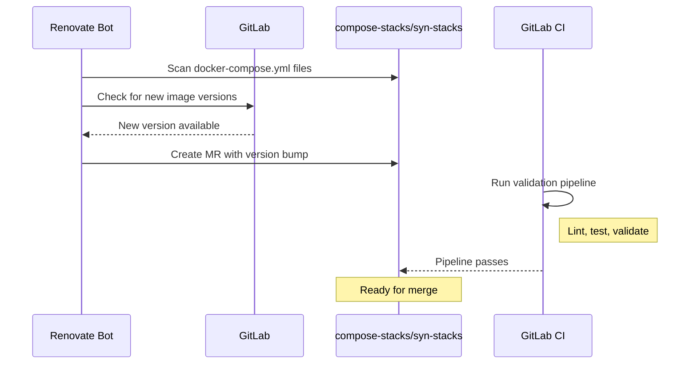

# Renovate

Renovate is used to automatically keep Docker image versions up-to-date across all compose stacks. It creates merge requests when new versions are available, allowing for controlled updates with CI/CD validation.

## How It Works



### Update Flow

1. **Scheduled Scans** - Renovate runs on a schedule (typically daily) to check for updates
2. **MR Creation** - When a new version is found, Renovate creates a merge request
3. **CI Validation** - GitLab CI runs linting and validation on the MR
4. **Review & Merge** - You review and merge when ready
5. **Deployment** - Merged changes trigger stack deployment via CI/CD or manual pull

## Configuration

Renovate is configured via `renovate.json` in each repository:

```json
{
  "$schema": "https://docs.renovatebot.com/renovate-schema.json",
  "extends": [
    "config:base",
    ":preserveSemverRanges"
  ],
  "docker-compose": {
    "fileMatch": ["(^|/)docker-compose\\.ya?ml$"]
  },
  "packageRules": [
    {
      "matchPackagePatterns": ["*"],
      "matchUpdateTypes": ["major"],
      "labels": ["major-update"]
    },
    {
      "matchPackagePatterns": ["*"],
      "matchUpdateTypes": ["minor", "patch"],
      "automerge": false
    }
  ]
}
```

### Key Settings

| Setting | Description |
|---------|-------------|
| `extends` | Base configuration presets |
| `docker-compose.fileMatch` | Pattern to find compose files |
| `packageRules` | Rules for handling different update types |
| `automerge` | Whether to auto-merge (disabled by default) |
| `labels` | Labels to apply to MRs |

## Renovate Dashboard

Renovate creates a **Dependency Dashboard** issue in each repository. This issue provides:

- **Overview of pending updates** - All available updates grouped by type
- **Rate limiting status** - How many MRs are open vs. allowed
- **Checkbox controls** - Force updates or rebase existing MRs

### Dashboard Location

| Repository | Dashboard |
|------------|-----------|
| compose-stacks | [GitLab Issues](https://gitlab.com/stetter-homelab/compose-stacks/-/issues?label_name=renovate) |
| syn-stacks | [GitLab Issues](https://gitlab.com/stetter-homelab/syn-stacks/-/issues?label_name=renovate) |

### Dashboard Features

```markdown
## Dependency Dashboard

This issue tracks all pending updates.

### Open PRs
- [ ] Update traefik to v3.1.0
- [ ] Update grafana/grafana to 10.4.0

### Pending Updates (Awaiting Schedule)
- prometheus/prometheus 2.50.0 -> 2.51.0

### Ignored or Blocked
- ❌ gitlab/gitlab-ce (major update, requires manual review)
```

**Checkboxes:**

- Check a box to force Renovate to create that MR immediately
- Useful for expediting security updates
- Also used to trigger rebases on existing MRs

## Handling Updates

### Minor/Patch Updates

These are typically safe and follow this workflow:

1. Review the MR changelog/release notes
2. Check CI pipeline passes
3. Merge when ready
4. Deploy to host (manual or automated)

### Major Updates

Major updates require more careful review:

1. Check breaking changes in release notes
2. Review application-specific migration guides
3. Test in a non-production environment if possible
4. Update configuration if needed
5. Merge and deploy

!!! warning "Critical Services"
    Major updates to critical services (Traefik, Vault, GitLab) should be tested thoroughly before merging. Consider:

    - Backing up configurations first
    - Having a rollback plan
    - Scheduling during maintenance windows

### Security Updates

Security updates should be prioritized:

1. Renovate labels security updates with `security`
2. Check the CVE severity
3. Expedite merge for critical/high severity
4. Use the dashboard checkbox to force immediate MR creation

## Repository Coverage

### compose-stacks

All stacks in `compose-stacks/` are monitored:

| Stack | Images Tracked |
|-------|----------------|
| core | traefik, vault |
| monitoring | prometheus, grafana, loki, jaeger |
| media | plex, sonarr, radarr, lidarr |
| ai | ollama, open-webui, n8n |
| frigate | frigate, mosquitto |
| ... | ... |

### syn-stacks

Core infrastructure on Synology:

| Stack | Images Tracked |
|-------|----------------|
| technitium | technitium/dns-server |
| node-exporter | prom/node-exporter |

## Best Practices

### Pin Major Versions

Pin to major versions to receive minor/patch updates automatically:

```yaml
# Good - receives 3.0.x and 3.x.y updates
image: traefik:v3

# More conservative - only receives 3.0.x patches
image: traefik:v3.0

# Avoid - no automatic updates
image: traefik:v3.0.1

# Avoid - unpredictable updates
image: traefik:latest
```

### Group Related Updates

Configure Renovate to group related updates:

```json
{
  "packageRules": [
    {
      "matchPackagePatterns": ["linuxserver/*"],
      "groupName": "linuxserver images"
    }
  ]
}
```

### Rate Limiting

Control how many MRs Renovate can open:

```json
{
  "prConcurrentLimit": 5,
  "prHourlyLimit": 2
}
```

### Schedule

Run Renovate during off-hours:

```json
{
  "schedule": ["after 2am and before 6am"]
}
```

## Troubleshooting

### MR Not Created

1. Check the Dependency Dashboard issue for pending updates
2. Verify the image tag format is recognized
3. Check Renovate logs in GitLab CI

### MR Shows Wrong Version

1. Check if you're using a custom tag format
2. Verify the image registry is accessible
3. Check `packageRules` for any version restrictions

### Updates Blocked

Common reasons:

- Rate limit reached (check `prConcurrentLimit`)
- Schedule hasn't triggered yet
- Image pinned to specific digest
- Registry authentication issues

## Related Documentation

- [Stack Overview](index.md)
- [ctr01 Stacks](ctr01.md)
- [Synology Stacks](synology.md)
- [Renovate Official Docs](https://docs.renovatebot.com/)
